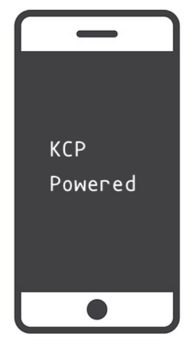

# ***libkcp***

[![Powered][1]][2] [![Build Status][3]][4]

[1]: https://img.shields.io/badge/KCP-Powered-blue.svg
[2]: https://github.com/skywind3000/kcp
[3]: https://travis-ci.org/xtaci/libkcp.svg?branch=master
[4]: https://travis-ci.org/xtaci/libkcp
FEC enhanced KCP client session library for iOS/Android, compatible with [kcp-go](https://github.com/xtaci/kcp-go).    



## ***Features***
1. Optimized for ***Online Games***.
1. Stream based interface, you can easily switch from your TCP based protocol to libkcp or dualstack.
1. [FEC(Forward Error Correction)](https://en.wikipedia.org/wiki/Forward_error_correction) Support with [Reed-Solomon Codes](https://en.wikipedia.org/wiki/Reed%E2%80%93Solomon_error_correction)

## ***Usage***
libkcp has been designed as a ***Frame-Driven*** library, the main loop was supposed as:       
```
GameInit()
NetworkInit()
While (!isGameOver) Do      // e.g:  A 30FPS Game
       LibKCP.Read()
       LibKCP.Write()
       LibKCP.Update()
       Game.Logic()
       Game.Render()
       Wait(33ms)   // clock
End
```

The ```Read/Write/Update``` functions of libkcp are ***guaranteed*** to be ***non-blocking***.       
Please read ```kcp_test.cpp fec_test.cpp``` for library usage.        

## ***Demo***
start echo server(golang)       
```
$go get github.com/xtaci/kcp-go
$go run kcpserver.go
```   
compile and run libkcp(Best with CLion), and watch output.      

## ***Caveats***
1. Packet level encryption has not been implemented yet.
   
## ***Troubleshooting***
1. C++11 is required for compiling.
